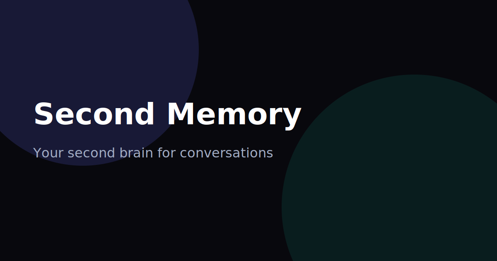
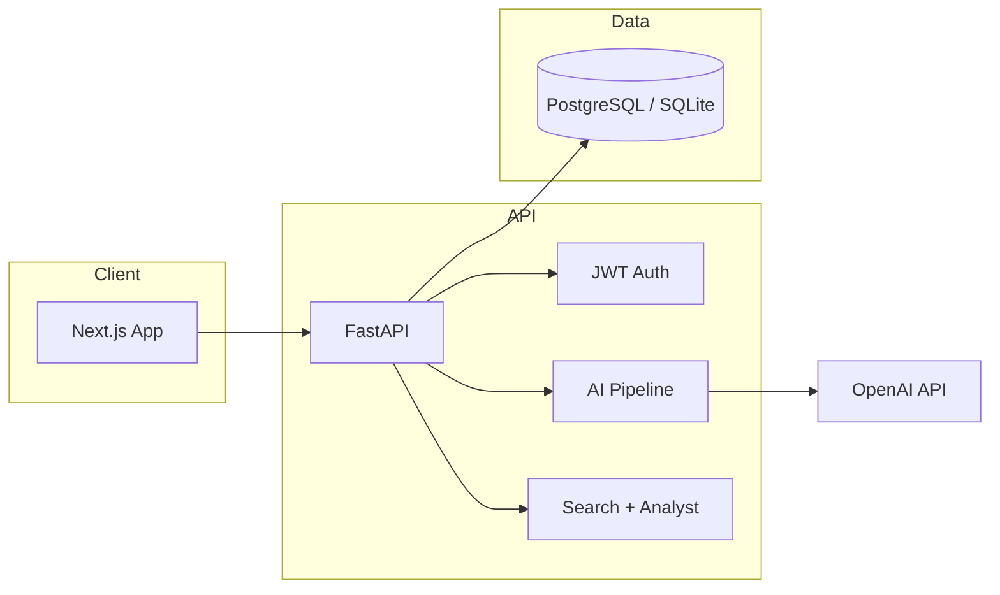

# Second Memory

**Your second brain for conversations.**

Second Memory is an AI-native workspace that records meetings, builds a living memory graph, and lets teams recall decisions instantly — across every conversation they've ever had.

Built with **Next.js 14 + FastAPI + OpenAI-compatible API** (supports any provider, e.g., OpenAI, FreeModel).



---

## Why Second Memory exists

Meetings create context. Context gets lost. Second Memory turns conversations into **structured, searchable, linked intelligence** — so your team never rebuilds the story from scratch.

Built as a portfolio-grade AI SaaS MVP with production patterns: auth, async processing, semantic search, bilingual i18n, and a premium product UI.

---

## Screenshots

| Dashboard | Meeting intelligence | AI Analyst |
|-----------|---------------------|------------|
| _Add screenshot: `/dashboard`_ | _Add screenshot: `/meetings/[id]`_ | _Add screenshot: `/search`_ |

> Replace placeholders with captures from demo login for your portfolio README.

---

## Features

- **Meeting intelligence** — TL;DR, decisions, action items, risks, effectiveness score
- **Sentiment analysis** — meeting mood, confidence, collaboration score, intensity
- **AI Next Steps** — smart recommendations for follow-up actions
- **Memory timeline** — cinematic vertical timeline of key moments
- **AI Analyst** — natural-language queries across your entire workspace
- **Related meetings** — lightweight cross-conversation linking
- **Daily AI Brief** — executive-style dashboard summary
- **Cmd+K command palette** — AI search + slash commands
- **PDF executive reports** — investor-ready exports
- **Settings & Profile** — avatar upload, language preference, display name
- **EN / RU i18n** — full bilingual interface

---

## Tech stack

| Layer | Technology |
|-------|------------|
| Frontend | Next.js 14, TypeScript, Tailwind, Framer Motion, Zustand, Sonner |
| Backend | FastAPI, SQLAlchemy async, JWT, ReportLab |
| Database | PostgreSQL (Docker) / SQLite (local dev) |
| AI | AsyncOpenAI (any OpenAI-compatible provider), Whisper |
| Auth | bcrypt + JWT (HS256) |
| i18n | Custom Zustand store with localStorage persistence |

---

## Architecture



### AI pipeline (high level)

1. **Upload / record** → audio stored, meeting row created
2. **Background job** → Whisper transcription
3. **LLM analysis** → summary, decisions, tasks, sentiment, next_steps, insights
4. **Index** → searchable text + semantic AI search / analyst context

---

## Quick start

### Prerequisites

- Node.js 18+
- Python 3.11+
- API key for an OpenAI-compatible provider ([get a free one at FreeModel.dev](https://freemodel.dev))

### Backend

```bash
cd backend
python -m venv .venv
.\.venv\Scripts\activate   # Windows
# source .venv/bin/activate  # macOS/Linux
pip install -r requirements.txt
cp .env.example .env       # add your OPENAI_API_KEY
python seed.py             # demo data (demo@meetmind.ai / demo1234)
uvicorn app.main:app --reload --port 8000
```

### Frontend

```bash
cd frontend
npm install
cp .env.local.example .env.local   # if present
npm run dev
```

Open [http://localhost:3000](http://localhost:3000)

### Demo credentials

| Email | Password |
|-------|----------|
| `demo@meetmind.ai` | `demo1234` |

Demo workspace includes **Nova Labs** meeting history: sprint planning, API reviews, product syncs, and cross-linked discussions.

---

## Design philosophy

- **Premium dark UI** — glass, ambient depth, subtle motion (Linear / Arc inspired)
- **Memory-first** — timelines, related meetings, workspace analyst
- **Polish over complexity** — no microservices; extend what works
- **Cinematic processing UX** — staged AI pipeline (frontend illusion, no websockets)

---

## Roadmap

- [ ] Real-time collaboration & shared workspaces
- [ ] Calendar integrations
- [ ] Custom memory tags & folders
- [ ] Slack / Teams notifications
- [ ] Enterprise SSO

## Repository

```
git clone https://github.com/your-username/second-memory.git
cd second-memory
```

---

## License

MIT — portfolio / demonstration use.

---

**Second Memory** — remember every conversation that matters.
